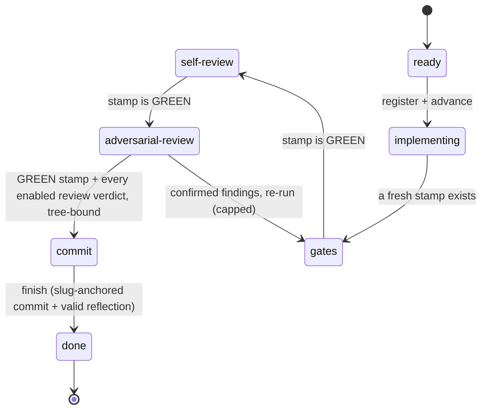
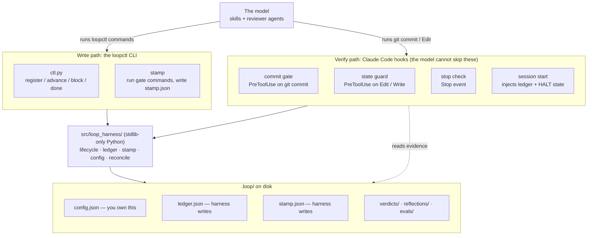
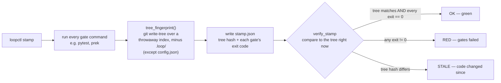
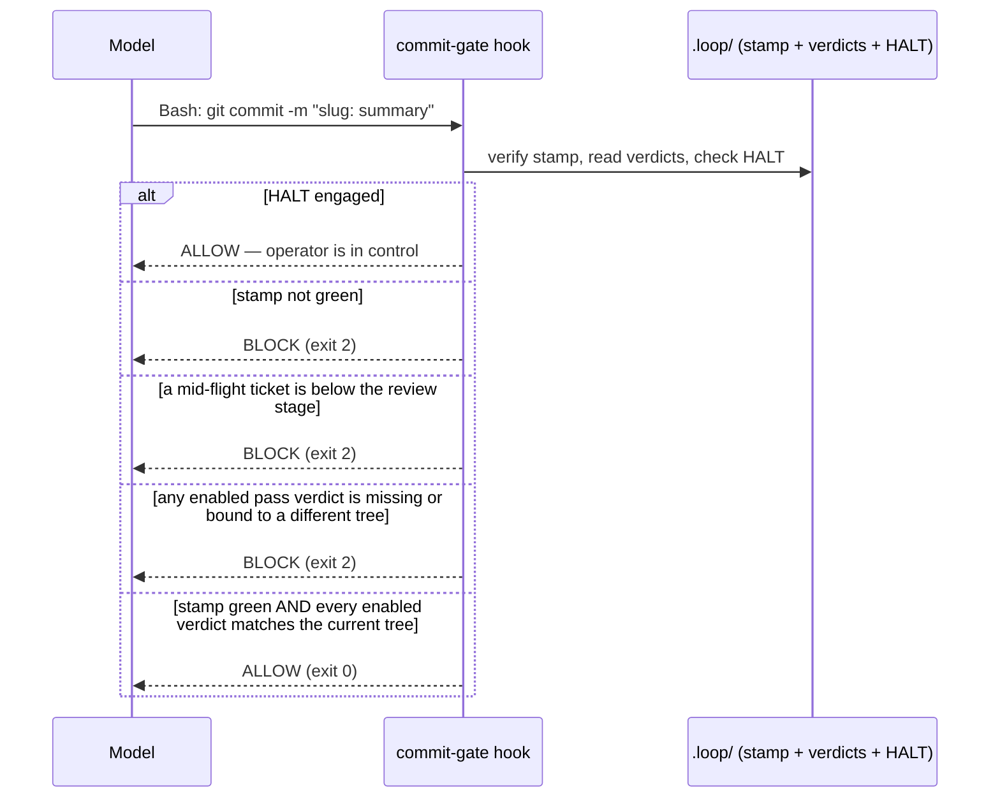

# Developer onboarding: how the loop harness works

The loop harness stops an AI coding agent from lying about its own
progress. When an agent says "tests pass, review is clean, ticket
closed," you normally have to take its word. This harness replaces the
agent's word with **evidence you can audit**: every claim must be backed
by a file on disk bound to the exact code it certifies. If the evidence
is missing or stale, the agent is blocked from moving forward. It cannot
talk its way past a step it did not actually complete.

This document explains that system from the top down. It starts with the
one idea, then the lifecycle, then the moving parts, then the two
mechanisms that make it work, and finally where the code lives and how to
develop on it. A glossary at the end defines every term the first time
you meet it. You do not need to know any of the jargon going in.

If you want the authoritative rules (with the code that enforces each
one), read `MANIFESTO.md` after this. This doc teaches; the manifesto
legislates.

---

## 1. The one idea

> The model proposes, the harness verifies, git is ground truth.

An autonomous coding loop fails in a predictable way: the model reports
success it did not achieve. The harness removes the model's ability to
self-certify. Progress happens only when a **tree-bound artifact** proves
the entry criteria for the next step. "Gates passed" is not a sentence in
a transcript. It is a stamp file that binds the exit codes of your test
commands to a fingerprint of your exact working tree.

Three rules follow from that idea, and they explain almost every design
choice in the codebase:

- **Evidence over claims.** A step advances only when a file on disk
  proves it earned the right to.
- **No silent judgment calls.** A design question the ticket does not
  answer becomes a `blocked` state with a coded reason, handed to you.
  The loop never guesses past a fork.
- **Fail safe, never fail open.** A bug in the harness fails *open* so it
  cannot wedge your session. A policy ambiguity (a broken config, a
  missing review) fails *safe* toward more checking, never toward none.

---

## 2. The lifecycle: one ticket's journey

Work is organized into **tickets**. Each ticket is one unit of change,
identified by a **slug** (a short kebab-case name like
`loop-config-review-passes`). A ticket moves through a fixed sequence of
**stages**. You cannot skip a stage, and each transition re-checks its
entry criteria against live evidence every time.



Read the labels on the arrows: they are the **evidence** each step
demands. In words:

| Stage | What it means | Evidence to enter it |
|-------|---------------|----------------------|
| `ready` | Ticket adopted, not started | Registered in the ledger |
| `implementing` | Writing code, tests first | An eval marker, if `require_eval` is on |
| `gates` | Test commands have run | A **stamp** matching the current tree |
| `self-review` | Model re-reads its own diff | The stamp is **green** (all gates exit 0) |
| `adversarial-review` | Independent reviewer agents inspect the diff | Green stamp |
| `commit` | Change is committed to git | Green stamp **and** a passing, tree-bound verdict from every enabled review pass |
| `done` | Ticket closed, ledger folded into the commit | A slug-anchored commit and a schema-valid reflection |

Two escape hatches sit outside the straight line:

- **The findings loop.** If a reviewer confirms a real problem, the
  ticket drops from `adversarial-review` back to `gates` to fix and
  re-prove it. This loop is capped by `max_review_cycles` (default 3). At
  the cap, the ticket blocks with code `cap-exceeded` instead of looping
  forever.
- **`blocked`.** Reachable from any active stage, it records a coded
  reason (an unresolved design fork, an out-of-scope fix, a flaky gate,
  and so on). A blocked ticket returns only to `ready`, and only after
  you resolve the blocker. This is how the loop refuses to guess: it hands
  the decision to you rather than picking silently.

---

## 3. How the pieces fit together

Four layers cooperate. The top layer is behavior the model performs; the
bottom three verify what it did.



The important thing to notice: there are **two paths into the core, and
the model does not control the second one.**

- The **write path** is `loopctl`, the one blessed CLI. The model asks to
  advance a ticket or run the gates by calling `loopctl`. Every `advance`
  re-validates against evidence, so this path already refuses illegal
  moves.
- The **verify path** is Claude Code **hooks**: scripts that Claude Code
  runs automatically on certain events, before the model's action takes
  effect. When the model tries to `git commit`, the commit-gate hook runs
  first and can veto it. The model cannot disable or route around a hook.
  This is why the harness can trust the outcome: the last word belongs to
  code the agent cannot edit mid-flight.

The **core** (`src/loop_harness/`) is plain Python with no third-party
dependencies, so any repo can adopt the harness with no install step. The
CLI and the hooks both call the same core functions, so a rule is defined
once and enforced identically in both places.

Everything durable lives under `.loop/`. You own `config.json`. The
harness owns `ledger.json` and `stamp.json` (the state guard blocks you
from editing them by hand). The `verdicts/`, `reflections/`, and `evals/`
directories hold the per-ticket evidence files.

---

## 4. Mechanism one: the stamp

The stamp is the heart of the system, so it is worth understanding in
detail. A **gate** is any shell command that exits non-zero when
something is wrong: your test suite, your linter, a coverage threshold, a
custom script. You list your gates in `.loop/config.json`. A **stamp** is
the recorded proof that those gates ran, and the exact tree they ran
against.



The clever part is the **tree fingerprint**. It is a single hash of your
entire working tree (tracked and untracked files, respecting
`.gitignore`), produced by `git write-tree` against a scratch index. One
function computes it, and every reader calls that one function, so a gate
can never pass in one place and block in another.

Two properties fall out of this design:

- **A stamp goes stale the instant the tree changes.** Edit one character
  after the gates ran and the fingerprint no longer matches, so the stamp
  authorizes nothing until you re-run `loopctl stamp`. You cannot run the
  tests, then quietly change the code, then commit on the old green light.
- **Loop bookkeeping never invalidates a code stamp.** The `.loop/`
  directory is stripped out before the fingerprint is computed, except
  `config.json`, which is bound in because it defines your gates and
  ignore-list. So writing the stamp, updating the ledger, or engaging the
  kill switch does not stale your green stamp. But changing what "green"
  means by editing `config.json` does, forcing a re-stamp and re-review.

An empty gate list never stamps green. An unconfigured repo fails loudly
rather than certifying an untested tree.

---

## 5. Mechanism two: the verdict and the commit gate

A green stamp proves the *machine* checks passed. Independent **review**
proves a *reviewer* looked at the diff. During the `adversarial-review`
stage, the loop dispatches one or more reviewer agents (configured as
**review passes**). Each reviewer re-runs the gates itself and writes its
own **verdict** file under `.loop/verdicts/`, containing a `verdict: pass`
line and a `tree:` fingerprint of what it reviewed.

When the model finally runs `git commit`, the commit-gate hook fires and
makes the final decision:



Because each verdict is bound to a specific tree fingerprint, a post-review
edit changes the tree and instantly invalidates every verdict, forcing a
fresh review. The reviewer, not the model, is the only party that can pass
review, and the commit gate requires a passing verdict from *every*
enabled pass, all bound to the same tree.

The gate is deliberately biased toward safety. If the config is broken and
cannot be parsed, the gate does not fall open and skip review. It falls
back to requiring the mandatory adversarial pass. The only way to a
stamp-only commit is to set `require_review: false` on purpose, which is
warned about at every session start.

---

## 6. Configuration

You configure the harness per repo through `.loop/config.json`. Scaffold a
starter with the `init-loop` skill, which runs `loopctl init` and proposes
real gates from the repo's manifests, then edit it. Here is the full surface:

```json
{
  "gates": [
    "git add --intent-to-add -A . && uv run pytest",
    "uvx prek run --all-files"
  ],
  "plans_dir": "~/.claude/plans",
  "notify_title": "loop harness",
  "max_review_cycles": 3,
  "require_review": true,
  "require_eval": false,
  "review_passes": [
    { "id": "adversarial",   "agent": "loop-reviewer",     "enabled": true },
    { "id": "architectural", "agent": "loop-architect",    "enabled": false, "baseline": "MANIFESTO.md" },
    { "id": "documentation", "agent": "loop-doc-reviewer", "enabled": false }
  ],
  "action_stages": [
    { "id": "update-documentation", "type": "agent", "ref": "loop-doc-writer", "after": "implementing", "enabled": false }
  ]
}
```

- **`gates`** is your extension mechanism. Any shell command that exits
  non-zero on a violation becomes enforced machinery: the stamp records its
  exit code, the commit gate refuses the tree until it passes, and the
  reviewer re-runs it. No plugin change is needed to add a gate. Order them
  cheapest-first; every gate runs on every stamp even after an earlier one
  fails, so you get the full picture each time.
- **`review_passes`** is the list of reviewer agents that run at the review
  stage. Each names an agent (the plugin ships `loop-reviewer`,
  `loop-architect`, and `loop-doc-reviewer`; your own custom passes live in
  `.claude/agents/`) and writes its own tree-bound verdict. A commit needs a
  passing verdict from every enabled pass. An empty or all-disabled list is a
  loud config error unless you also set `require_review: false`.
- **`action_stages`** are *advisory*. Each dispatches an agent or skill at a
  lifecycle anchor (for example, a doc-writer after `implementing`), but
  writes no verdict and gates nothing. The harness cannot prove an advisory
  stage ran, so it never pretends to. If you want documentation freshness
  enforced, use the `documentation` review pass (which writes a verdict),
  not the writer action (which only edits docs). A tree-mutating action
  must run at `after: implementing` so its edits ride the stamped tree.
- **`require_eval`**, when true, refuses to enter `implementing` until a
  schema-valid **eval marker** (`.loop/evals/<slug>.md`) exists: a small
  set of scenario rows (an input and its expected outcome, plus guardrail
  rows for what the change must refuse). It pins the Definition of Done as
  concrete cases before the code. The harness only checks the file exists
  and has the shape (an `eval: <slug>` header and at least one scenario
  row); it never runs the cases or checks they pass. The forcing function
  is the discipline of writing the spec first, co-authored with the
  `create-eval` skill, not a green eval.

To build your own review pass or action stage step by step, follow
`docs/tutorials/custom-reviews-and-actions.md`.

The harness checks the eval marker and the reflection for *shape*, never
for *substance*. It gates on the discipline of writing the eval set and the
reflection at all, and leaves their quality to you. A design choice
like this is why the config is small: the harness enforces process, and
trusts you to own the judgment.

---

## 7. The protocol, step by step

Here is the checklist the `implement-ticket` skill follows. It drives
exactly one ticket per invocation and then stops. Section 8 then walks a
concrete ticket through every step, so read this as the skeleton and the
next section as the flesh on it.

1. **Perceive.** `loopctl reconcile` corrects the ledger from git, then
   `loopctl ledger` prints where everything stands. Pick a `ready` ticket.
2. **Adopt.** `loopctl register <slug>`, then
   `loopctl advance <slug> implementing`.
3. **Implement, tests first.** Write a failing test, then the code to pass
   it. Touch only what the ticket's declared code surface allows; needing
   more is an `out-of-scope-fix-needed` block, not a quiet decision.
4. **Gate.** `loopctl stamp` runs your gate commands and records the
   evidence. Red gates get fixed and re-stamped. Then
   `loopctl advance <slug> gates` (refused without a fresh stamp).
5. **Self-review.** Re-read the diff against the ticket, then
   `loopctl advance <slug> self-review` (needs a green stamp).
6. **Review.** `loopctl advance <slug> adversarial-review`, then dispatch
   every enabled review pass concurrently against one captured tree
   fingerprint. Each writes its own verdict. Confirmed findings loop back
   to `gates`; a disputed finding blocks and escalates to you.
7. **Commit.** `loopctl advance <slug> commit` (refused unless the stamp is
   green and every verdict is bound to the current tree), then
   `git commit` with the subject `<slug>: summary`. The commit-gate hook
   re-verifies everything independently before letting the commit through.
8. **Reflect and close.** `loopctl reflect <slug>` scaffolds a reflection
   file to fill in. `loopctl finish <slug>` refuses to close without a
   schema-valid reflection and a slug-anchored commit, then folds the
   ledger update and reflection into that commit. Stop.

Across recurring runs, `loopctl distill` aggregates the friction tags from
all reflections and hands the recurring ones to the `ticket-planner` agent,
which authors improvement tickets under the same discipline. The loop
improves itself without leaving the loop.

---

## 8. A worked example: `reject-blank-username`

The protocol above is abstract. Here is a full cycle with real commands and
real files, and every term explained the moment it appears. The `$` lines
are what you (or the loop) type; the lines under them are what the tool
prints back. Throughout, `loopctl` is shorthand for the harness CLI: the
session-start message prints its exact path as `[loop] ctl: python3 "..."`.

**The scenario.** You maintain a small web app. A bug report says the signup
form accepts a blank username. You want the validator to reject one. This
repo's `.loop/config.json` runs two **gates** (shell commands that must exit
zero: `uv run pytest` and `uvx prek run --all-files`) and one **review
pass** (the `loop-reviewer` agent). `require_eval` is off, so no eval marker
is needed to start.

### Step 0: the ticket

A **ticket** is the contract for one unit of change, written to the plans
directory (default `~/.claude/plans/`) and named after its **slug**, a
short kebab-case identifier that also names every file the change produces.
The `create-ticket` skill authors the full contract (eleven sections);
abbreviated, ours is:

```markdown
# reject-blank-username: reject blank usernames in the signup validator

Size: S. Triggered by: bug report BR-241 (blank username accepted).

## Code surface
- src/app/signup.py:12  validate_username — add a blank-input check
- tests/test_signup.py   add the reproducing test

## Tests & validation gates
- new test: test_blank_username_rejected (fails against today's code)
- gates: uv run pytest ; uvx prek run --all-files
```

The **Code surface** is the whitelist of files the change may touch. The
"every changed line traces to the ticket" scope rule is checked against it,
so needing a file that is not listed is a blocker, not a quiet decision.

### Step 1: perceive

First reconcile, then look at the ledger. **Reconcile** means correcting the
**ledger** (the harness's per-ticket state file) from git history, because
git is ground truth and the ledger is not:

```console
$ loopctl reconcile
ledger consistent with git

$ loopctl ledger
[loop] ledger:
  (empty - no tickets registered)
[loop] HALT: clear
```

`HALT: clear` means the kill switch is off. (`HALT` is the operator's stop
button, the file `.loop/HALT`; while engaged, the loop stands down.)

### Step 2: adopt the ticket

**Register** creates a ledger entry at stage `ready`; **advance** moves it
one stage forward, re-checking the entry criteria first:

```console
$ loopctl register reject-blank-username
reject-blank-username: registered (ready)

$ loopctl advance reject-blank-username implementing
reject-blank-username: ready -> implementing
```

If this repo had set `require_eval: true`, that second command would refuse
until an eval marker (`.loop/evals/reject-blank-username.md`) existed: a
small scenario set (input to expected outcome, plus guardrail rows) that
pins the Definition of Done before any code. The harness only checks the
file is present and correctly shaped, never that its cases pass.

### Step 3: implement, test first

Write the failing test before the fix, so you know the test can actually
fail:

```python
# tests/test_signup.py
import pytest
from app.signup import validate_username

def test_blank_username_rejected():
    with pytest.raises(ValueError):
        validate_username("   ")
```

```console
$ uv run pytest tests/test_signup.py -q
E   Failed: DID NOT RAISE <class 'ValueError'>
1 failed
```

Now the fix:

```python
# src/app/signup.py
def validate_username(name: str) -> str:
    """Return the trimmed username, or raise if it is blank."""
    cleaned = name.strip()
    if not cleaned:
        raise ValueError("username must not be blank")
    return cleaned
```

```console
$ uv run pytest tests/test_signup.py -q
1 passed
```

### Step 4: gate

`loopctl stamp` runs every configured gate, records each exit code, and
writes a **stamp**: the proof that the gates ran, bound to a **tree
fingerprint** (a single git hash of your exact working tree):

```console
$ loopctl stamp
======= test session starts =======
128 passed in 2.4s
prek....................Passed
stamp written: .loop/stamp.json
ok
```

The final `ok` means the stamp is **green**: every gate exited zero and the
fingerprint matches the code right now. Here is what it wrote:

```json
{
  "tree": "4f2a9c1e7b3d8a05f6c2e1b9d4a7c3e8f0b6d2a1",
  "gates": [
    { "command": "git add --intent-to-add -A . && uv run pytest", "exit": 0 },
    { "command": "uvx prek run --all-files", "exit": 0 }
  ],
  "at": "2026-07-05T18:52:04.113Z"
}
```

With a fresh stamp on disk, advance:

```console
$ loopctl advance reject-blank-username gates
reject-blank-username: implementing -> gates
```

This is refused if the stamp is missing or **stale** (the tree changed since
the gates ran). Edit one character now and the fingerprint no longer
matches, so you would have to re-stamp.

### Step 5: self-review

Re-read your own diff against the ticket. Every changed line should trace to
the Code surface:

```console
$ git diff --stat
 src/app/signup.py    | 5 +++++
 tests/test_signup.py | 4 ++++

$ loopctl advance reject-blank-username self-review
reject-blank-username: gates -> self-review
```

This advance (and the next) requires a green stamp.

### Step 6: adversarial review

Enter the review stage, then dispatch the review pass:

```console
$ loopctl advance reject-blank-username adversarial-review
reject-blank-username: self-review -> adversarial-review
```

The loop reads the frozen tree fingerprint from `.loop/stamp.json`
(`4f2a9c1e...`) and hands the `loop-reviewer` agent the ticket, the diff,
the gate commands, that fingerprint, and its output path
`.loop/verdicts/reject-blank-username.adversarial.md`. The reviewer is
independent: it re-runs the gates itself and reads the real code rather than
trusting a summary. Its one and only write is its **verdict**, a pass/fail
file bound to the tree it reviewed:

```markdown
# .loop/verdicts/reject-blank-username.adversarial.md
verdict: pass
tree: 4f2a9c1e7b3d8a05f6c2e1b9d4a7c3e8f0b6d2a1

Re-ran gates: 128 passed, prek clean. The new test fails against the
old code (confirmed: the previous validate_username never raised).
Both changed files are in the ticket's Code surface. No findings.
```

That `tree:` line is what makes the verdict **tree-bound**: it certifies one
exact tree. Edit the code after this and the fingerprint changes, which
voids the verdict and forces a fresh review.

> **If the reviewer had found a real bug** it would write `verdict: fail`.
> You would fix it, then run `loopctl advance ... gates` again, dropping
> back to re-stamp and re-review. That return trip is the **findings loop**,
> capped at `max_review_cycles` (3 here). At the cap the ticket blocks with
> the code `cap-exceeded` instead of looping forever.

### Step 7: commit

Advance to `commit`, then commit. Watch what happens on the `git commit`:

```console
$ loopctl advance reject-blank-username commit
reject-blank-username: adversarial-review -> commit

$ git commit -am "reject-blank-username: reject blank usernames in signup validator"
loop gate: stamp ok; verdicts bound
[main a1c3e9f] reject-blank-username: reject blank usernames in signup validator
```

The `git commit` did not go straight through. It triggered the
**commit-gate hook**, a script Claude Code runs before the commit takes
effect, which the model cannot skip. The hook re-checked everything
independently: the stamp is green, and the reviewer verdict's `tree:`
matches the tree being committed. Both held, so it printed `loop gate: stamp
ok; verdicts bound` and allowed the commit. The subject starts with the
slug, which is the convention the reconciler matches on.

### Step 8: reflect

Every ticket closes with a **reflection**, a short writeup of what worked and
what did not. First scaffold it:

```console
$ loopctl reflect reject-blank-username
scaffolded .loop/reflections/reject-blank-username.md - fill in friction/worked, then re-run to validate
```

Fill in the frontmatter and prose:

```markdown
---
slug: reject-blank-username
cycles: 0
gates_red: 0
blockers: []
friction: []
worked: [tests-first, clean-review]
---

## What worked
The reproducing test made the fix obvious; review passed first try.

## What worked less well
Nothing notable for a change this small.
```

Re-run to validate. The harness checks the frontmatter for **shape** (the
required fields, the controlled friction vocabulary), never for prose
quality:

```console
$ loopctl reflect reject-blank-username
valid
```

### Step 9: close and stop

`loopctl finish` closes the ticket, but only because a slug-anchored commit
exists and the reflection is schema-valid. It then **folds** the ledger
update and the reflection into that same commit (via `git commit --amend`),
so the finished ticket is one clean commit:

```console
$ loopctl finish reject-blank-username
reject-blank-username: done (commit a1c3e9f7d2)
ledger consistent with git
folded ledger update into: a1c3e9f reject-blank-username: reject blank usernames in signup validator
```

The ledger now shows the ticket done, and the loop stops:

```console
$ loopctl ledger
[loop] ledger:
  reject-blank-username: done
[loop] HALT: clear
```

**What just happened.** At no point did the model assert a stage was
complete. Each transition was unlocked by a file on disk (the stamp, the
verdict, the reflection), each bound to the exact tree it certified. That is
the whole idea in one run: the model proposed, the harness verified, and git
holds the result.

---

## 9. Where the code lives and how to develop

The core is a stdlib-only Python package. Each module owns one concern:

| Module | Responsibility |
|--------|----------------|
| `cli.py` | The single `loopctl` entry point; dispatches every command. |
| `lifecycle.py` | The state machine: entry criteria for every transition. |
| `ctl.py` | The only supported ledger write path (register, advance, block, done). |
| `ledger.py` | Durable per-ticket state and atomic persistence. |
| `stamp.py` | Run the gates, bind exit codes to a tree fingerprint. |
| `hooks.py` | The Claude Code surface: commit gate, state guard, session and stop checks. |
| `config.py` | Parse and validate `.loop/config.json`. |
| `reconcile.py` | Correct the ledger from git history; git wins every disagreement. |
| `reflection.py` | Per-ticket reflection files and the `distill` aggregation. |
| `evals.py` | The pre-code definition-of-done marker and its schema. |
| `halt.py` | The kill switch, operator notifications, and the handoff log. |

The behavioral layer lives outside `src/`: `skills/` holds the skills the
model runs (`init-loop`, `create-ticket`, `implement-ticket`,
`create-eval`), and
`agents/` holds the reviewer and planner agents. `hooks/hooks.json` wires
the four hooks into Claude Code events.

Local development:

```bash
uv sync                    # install the dev environment
uv run pytest              # the test suite (every change ships with a test)
uvx prek run --all-files   # lint, type-check, formatting
```

Two conventions matter most when you contribute:

- **Keep the core dependency-free.** `src/loop_harness/` imports only the
  standard library. This is a value held by review, not a CI gate, so
  guard it yourself.
- **Read the manifesto before changing a rule.** `MANIFESTO.md` lists the
  invariants (the rules the harness must never break) and names the exact
  line of code that enforces each one. If you touch behavior near an
  invariant, keep the manifesto honest.

---

## 10. Glossary

- **Harness.** The whole system in this repo: the guardrails that verify an
  agent's work instead of trusting its report.
- **Plugin.** How the harness ships to Claude Code. Installing it registers
  the hooks, skills, and agents automatically.
- **Hook.** A script Claude Code runs automatically on an event (a commit
  attempt, a file edit, session start, session stop), before the action
  takes effect. The model cannot skip a hook.
- **Gate.** A shell command that exits non-zero on a violation (tests,
  linter, coverage). You list them in `config.json`.
- **Stamp.** The recorded proof that the gates ran, plus a fingerprint of
  the tree they ran against. Green means all gates passed on the current
  tree.
- **Tree fingerprint.** A single hash of the whole working tree, computed
  by `git write-tree` with `.loop/` excluded. Any code change changes it.
- **Ledger.** The per-ticket state file (`ledger.json`): stage, attempts,
  review cycles, blockers. It records what git cannot.
- **Slug.** A ticket's short kebab-case identifier, used to name its
  commit, verdict, reflection, and eval files.
- **Verdict.** A reviewer agent's tree-bound `pass`/`fail` file under
  `.loop/verdicts/`. Required, per enabled pass, to reach `commit`.
- **Review pass.** One configured reviewer agent that writes a verdict.
- **Action stage.** An advisory agent or skill dispatched at a lifecycle
  anchor. Writes no verdict, gates nothing.
- **Reconcile.** Correcting the ledger from git history, since git is
  ground truth and the ledger is not.
- **Blocker code.** A coded reason a ticket is stuck (for example
  `unresolved-design-fork`), handed to you instead of guessed.
- **Eval marker.** A pre-code Definition-of-Done file
  (`.loop/evals/<slug>.md`): a small set of scenario rows (input to
  expected outcome, plus guardrails). Required to start implementing when
  `require_eval` is on. The harness checks only its shape, never that the
  scenarios pass.
- **Reflection.** A required per-ticket writeup of what worked and what did
  not, checked for shape at `finish` and aggregated by `distill`.
- **HALT.** The kill switch (`.loop/HALT`). While engaged, the loop stops
  and the commit gate steps aside so you are in control.
- **Fail open vs. fail safe.** A harness bug fails *open* (allows, never
  wedges your session). A policy ambiguity fails *safe* (toward more
  review, never less).
</content>
</invoke>
