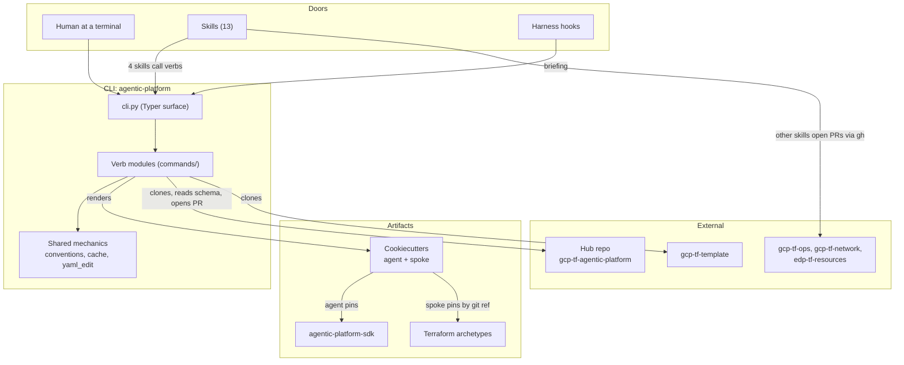
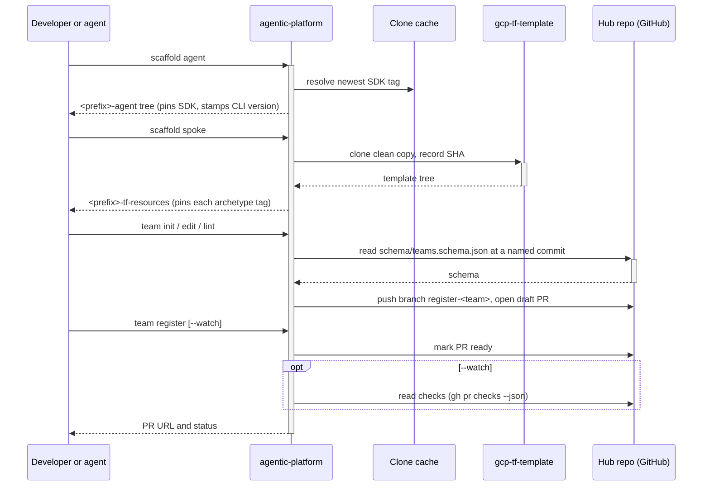
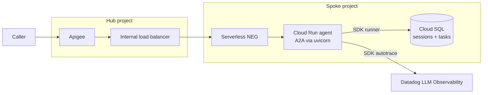
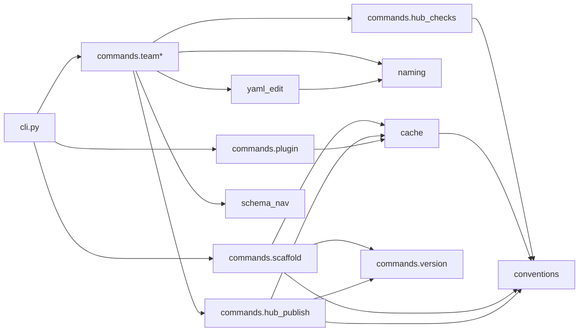

# Architectural Blueprint: rail-agentic-templates

> Generated on 2026-09-26 | Scanned by Claude Code `/blueprint`

## Technology Stack

| Category | Technology |
|----------|-----------|
| Language(s) | Python 3.11+, Terraform (HCL, >= 1.11), Markdown (skills, docs, knowledge bundle), Bash (skill preflights) |
| Framework(s) | Typer + rich + questionary (CLI), cookiecutter (templates), Google ADK with A2A (generated agents, SDK) |
| Package Manager | uv, one lockfile per distribution; no uv workspace |
| Build System | hatchling + hatch-vcs (version from git tags), `just` task runner, prek pre-commit hooks |
| Database | None in this repo. Generated agents use Cloud SQL Postgres (SQLAlchemy async + psycopg 3) |
| Testing | pytest, testcontainers (harness tests in Docker), golden-tree fixtures, shakedown (model-in-the-loop skill cases) |
| CI/CD | GitHub Actions: `tests.yml`, `release.yml`, `plugin-tag.yml` |
| Deployment | Python wheels to GCP Artifact Registry (`rail-python-packages`) via Workload Identity Federation; archetypes and plugin released as git tags only |

## System Overview

`rail-agentic-templates` is the project factory for the RAIL agentic platform
at Rituals. A team that wants to run an agent on GCP uses it to generate an
agent repository, generate the Terraform repository ("spoke") that hosts the
agent, register the team and its agent with the central hub, and install the
coding-agent skills that do all of this for them. The repo does not run
anything itself. It ships tools and artifacts that other repositories consume.

The system is one core with many doors. The core is a single CLI,
`agentic-platform` (alias `agp`), which does every mechanical step:
rendering templates, cloning upstream repos, validating the team file against
the hub's schema, and opening the hub pull request. The doors are a human at a
terminal, the skills an agent loads through the Claude Code plugin or Gemini
extension, and the harness hooks that steer an agent toward the right verb.
Below the core sit the artifacts it produces or pins: two vendored
cookiecutter templates (agent, spoke), three Terraform archetypes, and the
`agentic-platform-sdk` runtime library that every generated agent imports.

The repo's own rule for this split is "prompts may, code must": a skill may
route, sequence and judge, but anything with a right answer, a template or a
side effect belongs in a CLI verb
(`.okf/architecture/stable-spoke-interface.md`). This keeps humans, CI and
agents on one tested code path, and lets each artifact release on its own
schedule under its own tag family.

## Directory Structure

```
rail-agentic-templates/
├── packages/                  # two Python distributions, each with its own pyproject + lockfile
│   ├── agentic-platform/      # the CLI (agentic-platform / agp)
│   │   └── src/agentic_platform/
│   │       ├── cli.py         # Typer root: every verb's signature and help text
│   │       ├── commands/      # one module per verb family (scaffold, team*, hub_*, plugin, ...)
│   │       ├── cookiecutters/ # vendored templates: agent/ and spoke/
│   │       └── *.py           # shared mechanics: conventions, cache, yaml_edit, schema_nav, naming
│   └── agentic-platform-sdk/  # runtime library for generated agents (autotrace, runner, telemetry)
├── terraform/archetypes/      # cloud-run-agent, hub-permissions, discovery-engine-connector
├── skills/                    # 13 agent skills, one directory each (SKILL.md + optional scripts/)
├── hooks/                     # one hook manifest per harness (Claude, Gemini)
├── .claude-plugin/            # Claude Code plugin + marketplace manifests
├── gemini-extension.json      # Gemini CLI extension manifest (Gemini requires the repo root)
├── scripts/                   # standalone PEP 723 uv scripts: release, version coupling, hooks
├── shakedowns/                # skill conformance cases, fixture doubles, harness Dockerfiles, results
├── tests/                     # repo-level uv project (not a distribution): plugin, docs, archetypes, skills
├── docs/                      # consumer docs sorted by reader intent: how-to/, reference/
├── .okf/                      # knowledge bundle: concepts and 50 ADRs under decisions/
├── .github/workflows/         # tests, release, plugin-tag
├── justfile                   # gates: lint, test, test-sdk, test-repo
├── pyproject.toml             # ruff + mypy config only; no [project], no workspace
└── min-cli-version            # oldest CLI the shipped skills work with
```

The layout is sorted by artifact type, and each top-level folder has one
owner rule in `.claude/rules/monorepo-layout.md`. Tests of a distribution's
own code sit in that distribution. Everything else is tested from `tests/`.

## Component Map



### Component Details

#### CLI (`agentic-platform`)
- **Location**: `packages/agentic-platform/`
- **Responsibility**: The single entry point for every consumer task (ADR
  0012). It scaffolds agent and spoke repos, manages a team's hub
  registration, installs the plugin into Claude Code or Gemini CLI, and runs
  local diagnostics. Code owns the mechanics so that skills can be rewritten
  or deleted without losing a capability.
- **Key files**: `src/agentic_platform/cli.py`, `commands/scaffold.py`,
  `commands/team.py`, `commands/hub_publish.py`, `conventions.py`
- **Depends on**: cookiecutters (as data), the hub, `gcp-tf-template`, and
  this repo's own tags, all read through `cache.py` clones

#### Cookiecutter templates
- **Location**: `packages/agentic-platform/src/agentic_platform/cookiecutters/{agent,spoke}/`
- **Responsibility**: The trees the CLI generates. `agent` produces
  `<prefix>-agent`, an ADK agent served over A2A on Cloud Run, with its own
  CI, deploy and release workflows. `spoke` is an overlay laid onto a fresh
  clone of CCoE's `gcp-tf-template`, wiring the archetypes for dev and prod.
  They ship inside the CLI wheel and stamp the CLI version that rendered them
  (ADR 0021), so they have no release of their own.
- **Key files**: `cookiecutter.json`, `hooks/pre_gen_project.py` (refuses
  empty inputs, leftover placeholders, and non-tag refs)
- **Depends on**: the SDK (agent pins `==` a version), the archetypes (spoke
  pins each by `?ref=<archetype>-X.Y.Z`)

#### Terraform archetypes
- **Location**: `terraform/archetypes/`
- **Responsibility**: Reusable GCP compositions a spoke references by pinned
  git ref and never copies (ADR 0030). `cloud-run-agent` builds the Cloud Run
  service, Cloud SQL session store, secrets, serverless NEG backend and
  Datadog environment. `hub-permissions` grants the IAM the hub needs to front
  the agent. `discovery-engine-connector` sets up a data connector and alerts;
  the spoke template does not wire it in yet.
- **Key files**: each archetype's `variables.tf`, `outputs.tf`, generated
  `README.md`
- **Depends on**: the Google provider; one upstream module,
  `gcp-tf-foundation//modules/cloud_sql_instance?ref=0.10.1`. The Cloud Run
  service is a bespoke `google_cloud_run_v2_service` (ADR 0005).

#### SDK (`agentic-platform-sdk`)
- **Location**: `packages/agentic-platform-sdk/`
- **Responsibility**: Runtime code every generated agent shares, so a fix
  reaches all agents with a version bump. `autotrace` starts Datadog LLM
  Observability when `DD_LLMOBS_ENABLED` is set and must be the first import.
  `runner` builds an ADK runner and A2A task store backed by Cloud SQL.
  `telemetry` sets up JSON logging, tracing and LLM Obs span cleanup.
- **Key files**: `autotrace.py`, `runner.py`, `telemetry.py`
- **Depends on**: google-adk[a2a], ddtrace, SQLAlchemy, psycopg. It does not
  import the CLI, and the CLI does not import it.

#### Skills and hooks (the plugin)
- **Location**: `skills/`, `hooks/`, `.claude-plugin/`, `gemini-extension.json`
- **Responsibility**: The agent-facing doors. Four skills (`scaffold-agent`,
  `scaffold-spoke`, `create-team-registration`, `connect-agent-to-hub`) call
  CLI verbs and carry a `preflight.sh` that refuses when the CLI is missing or
  too old. `setup-spoke` sequences the whole onboarding across the other
  skills. The remaining skills open PRs against other teams' repos with `gh`
  or give guidance. Hooks inject a platform briefing at session start and
  refuse hand edits the CLI owns (the hub team file, unpinned archetype
  sources).
- **Key files**: `skills/setup-spoke/SKILL.md`, `hooks/claude-hooks.json`,
  `scripts/agent_briefing.py`, `scripts/cli_owned_guard.py`
- **Depends on**: the CLI (by name and `min-cli-version`), never on each
  other (ADR 0002)

#### Repo automation and quality gates
- **Location**: `scripts/`, `.github/workflows/`, `.pre-commit-config.yaml`,
  `shakedowns/`, `tests/`
- **Responsibility**: Keeps the artifacts consistent and releasable.
  `resolve_release_artifact.py` maps a tag to its family and directory.
  `check_version_coupling.py` refuses a commit where template imports, SDK
  symbols or archetype pins disagree. Shakedowns measure whether each skill
  keeps its promises under real harnesses.
- **Key files**: `scripts/resolve_release_artifact.py`,
  `scripts/check_version_coupling.py`, `scripts/next_release_version.py`,
  `shakedown.toml`
- **Depends on**: stdlib only (every script declares `dependencies = []`)

#### Knowledge bundle
- **Location**: `.okf/`
- **Responsibility**: Durable reasoning the code cannot state: 50 ADRs, plus
  concepts on architecture, integrations and practices. It is the source for
  most of the design decisions below.
- **Key files**: `.okf/index.md`, `.okf/architecture/stable-spoke-interface.md`

## Data Flow

The main flow is a team onboarding one agent. The skill or human drives, the
CLI does the work, and external repos receive the results.



Each generated repo then deploys on its own: the agent through its GitHub
Actions to Cloud Run, the spoke through Atlantis. The CLI keeps no state
between runs. A team's pending change is its open hub PR, found by branch
name (ADR 0047).

At runtime a request crosses from the hub into the team's spoke. The agent's
Cloud Run ingress defaults to internal plus load balancer, and a spoke can
override it.



## API Surface

### CLI Commands

Global options work in any position: `--no-cache`/`-n`, `--cache-dir`,
`--refresh`/`--no-refresh`, `-v`/`--verbose`, `-q`/`--quiet`.

| Command | Description |
|---------|-------------|
| `scaffold agent` | Render an ADK agent repo from the vendored `agent` template |
| `scaffold spoke` | Clone `gcp-tf-template` and overlay the spoke Terraform, pinning each archetype |
| `team init` | Create `teams/<team>.yaml` from the hub schema as a draft PR on `register-<team>` |
| `team edit` | Edit the team file, interactively or directly, preserving comments |
| `team lint` | Validate the team file against the hub schema |
| `team register` | Mark the team's PR ready for review; with `--watch`, follow its checks |
| `team list` | List teams on the hub |
| `plugin install` / `update` / `uninstall` | Install or remove the skills plugin for Claude Code or Gemini CLI |
| `plugin status` | Compare CLI and plugin versions against `min-cli-version` |
| `cache dir` / `cache clean` | Show or clear the clone cache |
| `agent-briefing` | Print the markdown briefing the SessionStart hook injects |
| `doctor` | Check uv, `gh` auth and gcloud credentials |
| `support` | Point to the Slack support form and print version info |
| `version` | Print the CLI version and each vendored template's version |

Mutating verbs take `--dry-run`, which prints the real effect plan. Exit codes
are stable: 0 ok, 1 failed, 3 target refused, 4 would drop existing
content, 64 usage error.

### Library exports (`agentic-platform-sdk`)

`__init__.py` re-exports nothing, so consumers import modules directly.

| Export | Type | Description |
|--------|------|-------------|
| `agentic_platform_sdk.autotrace` | import side effect | Starts `ddtrace.auto` when `DD_LLMOBS_ENABLED` is set |
| `runner.build_managed_runner(agent)` | function | ADK runner with sessions from `AGENT_STATE_DB_URI` and artifacts from `ARTIFACT_BUCKET` |
| `runner.build_managed_task_store()` | function | A2A task store backed by `AGENT_STATE_DB_URI` |
| `telemetry.configure_logging` / `configure_tracing` / `configure_llm_observability` | functions | JSON logs, OTLP tracing, LLM Obs span cleanup |

### Terraform archetype interfaces

| Archetype | Required inputs | Key outputs |
|-----------|-----------------|-------------|
| `cloud-run-agent` | `project_id`, `region`, `name`, `network`, `subnetwork` | `url`, `service_account_email`, `backend_service_self_link`, `agent_state_db_instance` |
| `hub-permissions` | `project_id` | `tier`, `hub_deploy_service_accounts`, `apigee_runtime_service_accounts` |
| `discovery-engine-connector` | `project_id`, `display_name`, `data_source`, `json_params`, `entities` | `connector_name`, `collection_id` |

### Plugin hooks

| Harness | Event | Matcher | Script |
|---------|-------|---------|--------|
| Claude Code | SessionStart | `^(startup\|resume\|clear)$` | `agent_briefing.py claude` |
| Claude Code | PreToolUse | `^(Edit\|Write)$` | `cli_owned_guard.py hub-intake`, `archetype-pin` |
| Gemini CLI | SessionStart | `*` | `agent_briefing.py gemini` |
| Gemini CLI | BeforeTool | `^(replace\|write_file)$` | `cli_owned_guard.py hub-intake`, `archetype-pin` |

### HTTP (generated agents only)

This repo serves no HTTP. Each generated agent runs
`uvicorn <package>.agent:a2a_app`, which serves the ADK/A2A defaults: an agent
card at `/.well-known/agent-card.json` and JSON-RPC at `/`. The app has no
auth of its own. Cloud Run IAM and the hub's Apigee front it.

## Dependencies

### External

| Dependency | Category | Purpose |
|-----------|----------|---------|
| typer, rich, questionary | CLI framework and UI | Command tree, help panels, interactive prompts |
| cookiecutter | Templating | Renders the agent and spoke templates |
| jsonschema, pyyaml | Validation, serialization | Checks the team file against the hub schema |
| packaging, platformdirs | Tooling | Version comparison; cache and plugin directories |
| google-adk[a2a] | Framework (SDK) | Agent runner, A2A server, task store |
| ddtrace, opentelemetry-exporter-otlp-proto-http | Observability (SDK) | Datadog LLM Observability and tracing |
| sqlalchemy[asyncio], psycopg[binary] | Database (SDK) | Cloud SQL Postgres sessions and tasks |
| testcontainers, pytest, mypy, ruff | Testing and tooling | Harness tests in Docker, unit tests, type and lint checks |
| gcp-tf-foundation `cloud_sql_instance` | Terraform module | Cloud SQL instance for `cloud-run-agent` |
| `gh`, `git`, `gcloud` | Local tools | Hub PRs, clones, credentials, checked by `doctor` |

### Internal Module Dependencies



Dependencies point one way: `cli.py`, then verb modules, then shared
mechanics. There are no cycles. `cli.py` loads most verb modules lazily
through `commands(name)`, so a static import graph misses those edges. The
`team_edit` and `team_submit` modules import `commands.team`, the one place
where commands depend on commands. The two distributions never import each
other. They are coupled only through the agent template's SDK pin, which
`scripts/check_version_coupling.py` checks at commit time.

## Architecture Patterns

- **Primary pattern**: A project-factory monorepo with one core and many
  doors. The CLI is the facade over all mechanics, and skills, hooks and
  humans are interchangeable callers.
- **Key abstractions**:
  - *Verb*: a CLI command with its logic in `commands/<verb>.py`. The command
    set is pinned by an equality test, so it grows only on purpose.
  - *EffectPlan*: a mutating verb lists its effects before running them, so
    `--dry-run` shows the real plan. `register_mutating` refuses a mutating
    verb without `--dry-run`.
  - *Clone cache*: one read-only clone per upstream (the hub,
    `gcp-tf-template`, this repo), refetched at most hourly (ADR 0015).
  - *Hub PR as state*: a team's pending change is its PR from
    `register-<team>`, so the CLI stores nothing locally (ADR 0047).
  - *Archetype*: a Terraform composition with its own tag family, pinned per
    spoke (ADR 0030).
- **Error handling**: Each module raises its own small exception types
  (`CacheError`, `HubError`, `ProjectionError`, and so on). Verbs catch them
  and return an exit code from `conventions.py`, and `cli._run` translates
  everything else into a code. Messages say what to do next and name the verb
  that owns the fix. Hooks exit 2 to block and fail open on their own errors.
- **Testing strategy**: Unit tests per distribution with injected fakes
  (`FakeRunner`) and a seeded local git upstream instead of the network.
  Golden-tree tests compare generated output byte for byte. Repo-level tests
  check the docs skeleton, layout rules, workflows (actionlint) and IAM parity
  between archetypes and the hub. Container tests install the plugin into
  real harness images. Shakedowns measure skill behavior with real models.

## Architecture Assessment

The core idea is right and more carefully built than most internal platforms.
The two risks are that the repo does not yet fully follow its own rule, and
that the process around the code is heavy for the team that maintains it.

### What works

- **"Prompts may, code must" is the right split.** Anything with a right
  answer lives in tested code, and the model only routes and judges.
  RFC-001's test ("delete every SKILL.md and a human loses nothing") is simple
  enough to enforce. Most agent tooling puts the mechanics in prose and then
  gets different results from run to run.
- **Skills are measured, not assumed.** Shakedowns treat a skill as something
  with a pass rate per harness, which is what a skill needs once it is
  production surface.
- **Versioning and provenance fit a platform many teams consume.** Each
  artifact has its own tag family. Generated repos record the CLI version
  that wrote them, spokes record the CCoE commit, and each spoke pins its
  archetypes. When a team's repo breaks, you can tell exactly what it got.
- **The CLI keeps no state.** A team's pending change is its open hub PR, so
  there is no local state to corrupt or migrate.
- **Contracts other repos own are read live.** The hub schema is fetched at
  run time and never copied, so it cannot drift silently.
- **Decisions are recorded, and a reversal is written into both records.**
  Most repos lose that reasoning within six months.

### Concerns

1. **Only four of the 13 skills go through the CLI.** The `request-*`,
   `cleanup`, `scaffold-infra-repo` and `update-branch-protection` skills
   edit other teams' repos with `gh` and `git` from prose. RFC-001 rules
   this out, and these will be the least repeatable skills in the plugin.
   This is the largest gap between the stated design and the code.
2. **Breakage from repos you do not own reaches the user's terminal.** The
   hub schema, `gcp-tf-template` main, and the JSON shape of `gh pr checks`
   can all change under a released CLI. Failing loudly is the right
   fallback, but CI should find the break before a team does.
3. **The process around the code is large compared to the code.** The CLI
   and SDK are about 11k lines. Around them are 50 ADRs, six release
   families, a 46 KB version-coupling checker, shakedowns, rules and a
   ticket loop. Each piece is sound on its own. Together they make every
   change expensive, and the knowledge needed to keep them working sits with
   few people. Adding a released package alone needs a tag family, a
   `PACKAGE_FAMILIES` entry, a CI job and a mypy hook, all by hand.
4. **The archetypes do not match the layout rule.** The rule says
   archetypes compose upstream building blocks. In practice they are mostly
   raw `google_*` resources, with one gcp-tf-foundation module. ADR 0005
   explains the custom Cloud Run service. The rest is unexplained, and a
   rule the code visibly breaks teaches people to ignore rules.
5. **`cli.py` concentrates everything.** About 1,400 lines hold every
   verb's signature and help text, and ADR 0012 guarantees more verbs.
   Module-level state in `cache` and `conventions` is safe only because
   `main()` resets it, which matters if anything ever calls the verbs from a
   long-lived process.

### Accepted costs

- Keeping two harnesses separate on purpose (manifests, hook files and
  `Harness` classes) is the honest choice while there are only two.
- No shared internal package until a third caller needs `conventions` or
  `cache`.
- Separate lockfiles instead of a uv workspace.

### Recommendations, in order

1. Move the deterministic parts of the `request-*` skills into CLI verbs, or
   exempt those skills from RFC-001 in writing. If CCoE and EDP take over
   those requests, the skills can shrink to routing.
2. Add a scheduled CI job that runs `scaffold spoke` and `team lint` against
   the current upstreams.
3. Resolve the archetype rule against the code: move the resources upstream
   into gcp-tf-foundation, or reword the rule.
4. Split `cli.py` into one Typer sub-app per command group, keeping the
   equality test on the command set.
5. Review which parts of the process are worth their cost. A useful test is
   whether a new platform engineer can ship a small change in their first
   week.

## Key Design Decisions

1. **Prompts may, code must** (RFC-001). A skill never does anything that has
   a right answer, a template or a side effect. That work is a CLI verb.
2. **The CLI is the one-stop shop** (ADR 0012). A new consumer capability
   defaults to a verb, and a capability reachable only through prose counts
   as a gap.
3. **Scaffold, not merge** (ADR 0011). `scaffold spoke` clones
   `gcp-tf-template` itself into a new directory and records the SHA. It never
   writes onto an existing clone.
4. **Templates ride the CLI release** (ADR 0021). The generator stamps its own
   version into every tree it writes.
5. **Each artifact is its own tag family** (ADR 0030, 0031, 0042). Tags are
   `<family>-X.Y.Z` for `cli`, `agentic-platform-sdk`, `plugin` and each
   archetype. A human cuts every release by picking an increment.
6. **Skills ship only as harness plugins and stay self-contained** (ADR 0002,
   0007, 0009). One hook manifest per harness, and hooks refuse only what a
   CLI verb already refuses.
7. **The hub owns the team file's shape** (ADR 0043, 0047). The CLI reads the
   schema from the hub at a named commit and edits the file one value at a
   time to keep human comments.
8. **Datadog is LLM Observability, not APM** (ADR 0038). Agents import
   `autotrace` first, and trace propagation is off so no header can route data
   to another team's dataset.

## Entry Points

| Entry Point | Type | Location | Description |
|------------|------|----------|-------------|
| `agentic-platform` / `agp` | CLI | `packages/agentic-platform/src/agentic_platform/cli.py:main` | Every consumer verb |
| Cookiecutter hooks | Generation-time | `cookiecutters/{agent,spoke}/hooks/{pre,post}_gen_project.py` | Validate inputs and tidy the generated tree |
| Generated agent server | HTTP (A2A) | `cookiecutters/agent/.../Dockerfile` | `uvicorn <package>.agent:a2a_app` on `$PORT` |
| SDK autotrace | Library import | `packages/agentic-platform-sdk/src/agentic_platform_sdk/autotrace.py` | First import in every agent; starts LLM Obs |
| SessionStart hook | Harness hook | `scripts/agent_briefing.py` | Injects the platform briefing or an upgrade warning |
| PreToolUse / BeforeTool guard | Harness hook | `scripts/cli_owned_guard.py` | Refuses edits a CLI verb owns and names the verb |
| Skills | Agent prose | `skills/*/SKILL.md` | Route to a CLI verb or open a PR on another repo |
| Release | CI | `.github/workflows/release.yml` | Release published or manual run with an increment; publishes the two wheels |
| Plugin tag | CI | `.github/workflows/plugin-tag.yml` | Tags `plugin-X.Y.Z` when the manifest version changes on main |
| Tests | CI | `.github/workflows/tests.yml` | Per-package pytest, repo tests, harness containers, actionlint |
| Gates | Dev | `justfile` | `just gates`: lint, test, test-sdk, test-repo |
